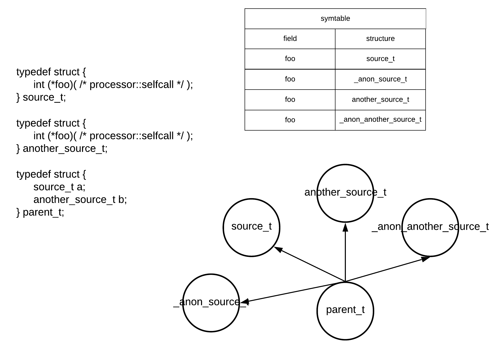

# SelfCall preprocessing
This repository contains a preprocessor for C language. The main idea is the `selfcall` attribute implementation.

## Repository
- `misc`:
    - `preprocessor.py` - Python attribute preprocessor. See `misc/README.md` for details.
    - `selfcaller.py` - Python the `C language AST-walker `. See `misc/README.md` for details.
- `tests` - C source files for test purposes.
- `vscode` - Preprocessor's extention to supress warnings from a canonical C-extention.
- `main.py` - Entry point.

## Requiered tools & Usage
### Required tools
There is a few things that are needed before we can proceed any further:
- [gcc](https://gcc.gnu.org/) - GCC or Clang compilers are essential for a basic C-preprocessing.
- [pycparcer](https://github.com/eliben/pycparser) - Basic library for AST operations.
    - [fake_libs](https://github.com/eliben/pycparser/tree/main/utils/fake_libc_include) - Fake std libs for the AST parsing process. P.S. place them in the `misc/pycparser_fake_libs` folder.
- [loguru](https://github.com/Delgan/loguru) - Fancy-looking logg messages. 

### Usage
For a sandbox usage, simply use the one of next commands:
```bash
python3 main.py --file tests/func_test.c
python3 main.py --file tests/cast_structs.c
python3 main.py --file tests/complex_structs.c
python3 main.py --file tests/nested_structs.c
```

Directory parsing are also supported. To do this, use the next command:
```bash
python3 main.py --directory <project> --include <preject_include>
```

### Testing
For testing use the next command:
```bash
python3 test.py
```

## SelfCall idea
The idea is simple. I love C language, and I want to improve it with the next annotation:
```c
/* processor::selfcall */
```

This annotation allows us to build and use structures in a completly new way:
```c
// foo.h
typedef struct string {
    int   size;
    char* body;
    int   (*get_size)( /* processor::selfcall */ );
    char* (*get_body)( /* processor::selfcall */ );
} string_t;

// foo.c
#include "foo.h"
static int string_get_size(struct string* self) {
    return self->size;
}

static int string_get_body(struct string* self) {
    return self->body;
}

int main() {
    string_t s = {
        .size = 13,
        .body = "Hello world!",
        .get_size = string_get_size,
        .get_body = string_get_body
    };

    return 0;
}
```

As you've notice above, the string structure has addtional annotation in argument' list in every function defenition. This annotation is used for a self argument passing to function calls, that are called from structures. In nutshell, we can use an aforementioned structure in the next new way:
```c
int main() {
    string_t s;
    printf("Size=%i\n", s.get_size());
    printf("Body=%s\n", s.get_body());
    return 0;
}
```

This tool allows us to ignore the first `self` parameter when we invoke a function with the `selfcall` attribute from a structure. 

# How it works?
## Summary
Let's consider the next code snippet:
```c
typedef struct {
    int (*get_size)( /* processor::selfcall */ );
    int (*set_size)( /* processor::selfcall */ int );
} string_t;

void foo(string_t* a) {
    a->set_size(a->get_size());
}
```

This is a very simple example of the `selfcall` annotation. With the `processor::selfcall` usage, an user can "reserve" the first argument for the `self` pointer. Aforementioned code snippet, after such a transformation becames a less-readeble, but at least, a correct version of C-code.
```c
typedef struct __anon_struct_string_t
{
  int (*get_size)(struct __anon_struct_string_t *);
  int (*set_size)(struct __anon_struct_string_t *, int);
} string_t;
void foo(string_t *a)
{
  a->set_size(a, a->get_size(a));
}
```

## C-preprocessor part
Before any work can be performed, we should get rid from a high-level pre-processor instructions such as `define`, `ifdef`, `undef`, `include`, `__attribute__`, etc. This work can be performed without any problems with use of the inbuilt gcc' pre-processor.

## Layout part
After C-pre-processor part we receive a raw form of a code. For instance I implie the next code as a raw code:
```c
typedef struct {
    int (*foo)( /* processor::selfcall */ );
} a_t;

typedef struct {
    void* b;
} b_t;

typedef struct {
    void* c;
} c_t;

int bar() {
    c_t c2; (
        (a_t*)(
            (b_t*)c2.c
        )->b
    )->foo();
}
```

With the `misc/preprocessor.py` tool we mark all structures, their depends, and `selfcall` functions. First things first we generate names for structs without name and with an annotated by `selfcall` function:
```c
typedef struct __anon_struct_a_t {
    int (*foo)( /* processor::selfcall */ );
} a_t;
```

Then we create a symtable and dependency graph for a provided code / project. This structures will be very helpful at the AST-part. In few words, the `symtable` memorize all functions and structures with the `processor::selfcall` annotation. This helps us to determine, is the selected function reqire a hidden `self` parameter. The `dependency graph` is a simple `DAG`. It links nested structures with each other. To demonstrate such structures, I'll illustatrare them below:


After aforementioned preparations, we replace the annotation `/* processor::selfcall */` with a structure signature:
```c
typedef struct __anon_struct_a_t {
    int (*foo)( struct __anon_struct_a_t* );
} a_t;
```

That' all what we do at this level. Now we can proceed further.

## AST part
With a prepared source code, we can safely invoke the `pycparser` library as a main parser in this project. The main idea of this part is simple:
- Find a function call node.
- Check if this function call invoked from a structure.
- Determine which structure is used.
- Determine is the invoked function annotated as a `selfcall` function. 
- If it is, pass the structure itselves to the function' arguments list.
- Restore the source code from an AST and pass it further.

The final result of aforementioned operations is a code, where all function calls, that are marked as `selfcall`s, fulfiled with the structure' pointer:
```c
typedef struct __anon_struct_a_t {
    int (*foo)( struct __anon_struct_a_t* );
} a_t;

typedef struct {
    void* b;
} b_t;

typedef struct {
    void* c;
} c_t;

int bar() {
    c_t c2; 
    ((a_t*)((b_t*)c2.c)->b)->foo((a_t*)((b_t*)c2.c)->b);
}
```

# Benefits
## Rust-style structures
Now C-programmer is able to use C-structures in a more convenient way. Instead of always passing structure itself as `self`-parameter:
```c
typedef struct a {
    int (*foo)(struct a*);
} a_t;

void bar(a_t* a) {
    a->foo(a);
}
```

he can simply annotate a function with `processor::selfcall` and use a Rust-like syntax:
```c
typedef struct {
    int (*foo)( /* processor::selfcall */ );
} a_t;

void bar(a_t* a) {
    a->foo();
}
```

## Clean code
Imagine a situation, where we're working with complex nested structures, that additionally are stored in variables with really long names:
```c
typedef struct a {
    int (*foo)(struct a*);
} a_t;

typedef struct {
    void* fang_is_always_singing_her_songs;
} b_t;

typedef struct {
    void* b_pointer_im_not_kidding;
} c_t;

void bar(c_t* really_long_name_for_c) {
    ((a_t*)((b_t*)really_long_name_for_c->b_pointer_im_not_kidding)->fang_is_always_singing_her_songs)->foo(((a_t*)((b_t*)really_long_name_for_c->b_pointer_im_not_kidding)->fang_is_always_singing_her_songs));
}
```

This code looks really bad, isn't it? To improve the overall appearance, we can ignore essential `self`-argument in the `foo` function:
```c
typedef struct {
    int (*foo)( /* processor::selfcall */ );
} a_t;

typedef struct {
    void* fang_is_always_singing_her_songs;
} b_t;

typedef struct {
    void* b_pointer_im_not_kidding;
} c_t;

void bar(c_t* really_long_name_for_c) {
    ((a_t*)((b_t*)really_long_name_for_c->b_pointer_im_not_kidding)->fang_is_always_singing_her_songs)->foo();
}
```

Now it looks a way better.

## Namespaces
We all know that C-language doesn't has any namespaces, that's why we usually encounter with a function naming problem. Actually we're able to solve such a problem with the `static` keyword and `headers`. This will "hide" a function' name from a compiler during a pre-processing phase. But what if we still need to use these functions? If we consider the code below:
```c
// a.h
#ifndef A_H_
#define A_H_
void foo();
void bar();
void baz();
#endif

// b.h
#ifndef B_H_
#define B_H_
void foo();
void bar();
void baz();
#endif

// main.c
#include <a.h>
#include <b.h>
int main() {
    foo();
    bar();
    baz();
    return 0;
}
```

the problem can be seen. Compiler will simply return the next error:
```bash
duplicate symbol '_baz' in:
    /var/folders/74/d7gcqwxd1x9__83fh6m_lb6c0000gn/T/a-3b8c3b.o
    /var/folders/74/d7gcqwxd1x9__83fh6m_lb6c0000gn/T/b-44b8f1.o
duplicate symbol '_bar' in:
    /var/folders/74/d7gcqwxd1x9__83fh6m_lb6c0000gn/T/a-3b8c3b.o
    /var/folders/74/d7gcqwxd1x9__83fh6m_lb6c0000gn/T/b-44b8f1.o
duplicate symbol '_foo' in:
    /var/folders/74/d7gcqwxd1x9__83fh6m_lb6c0000gn/T/a-3b8c3b.o
    /var/folders/74/d7gcqwxd1x9__83fh6m_lb6c0000gn/T/b-44b8f1.o
ld: 3 duplicate symbols for architecture x86_64
clang: error: linker command failed with exit code 1 (use -v to see invocation)
```

To solve it, we can easily use structures:
```c
// a.h
#ifndef A_H_
#define A_H_
typedef struct {
    int namespace_value;
    void (*foo)( /* processor::selfcall */ );
    void (*bar)( /* processor::selfcall */ );
    void (*baz)( /* processor::selfcall */ );
} a_namespace_t;
#endif

// b.h
#ifndef B_H_
#define B_H_
typedef struct {
    int namespace_value;
    void (*foo)( /* processor::selfcall */ );
    void (*bar)( /* processor::selfcall */ );
    void (*baz)( /* processor::selfcall */ );
} b_namespace_t;
#endif
```

In comparision with a classic function call, now we can call these functions thru the structure:
```c
int main() {
    b_namespace_t* b = make_b_namespace();
    b->foo();
    b->bar();
    b->baz();

    a_namespace_t* a = make_a_namespace();
    a->foo();
    a->bar();
    a->baz();
    return 0;
}
```

Additionally, to implement such a mechanism, user should mark these functions with `static` keyword and implement the `make_a_namespace` function.

# How to use it?
That's simple! Just create a structure, add any "function" field and mark it with `processor::selfcall`. Let's consider next example:
```c
// strobj.h
#ifndef STRING_H_
#define STRING_H_

#include <stdio.h>
#include <stdlib.h>
#include <string.h>

typedef struct {
    unsigned int size;
    const char*  body;
    unsigned int (*length)( /* processor::selfcall */ );
    int          (*print)( /* processor::selfcall */ );
} string_t;

string_t* create_string(const char* s);
int destroy_string(string_t* s);

#endif

// strobj.c
#include <strobj.h>

static int string_print(string_t* self) {
    printf("%s, size=%i\n", self->body, self->length());
    return 1;
}

static unsigned int string_length(string_t* self) {
    return self->size;
}

string_t* create_string(const char* s) {
    string_t* str = (string_t*)malloc(sizeof(string_t));
    if (!str) return NULL;

    str->body = (char*)malloc(strlen(s) + 1);
    if (!str->body) {
        free(str);
        return NULL;
    }

    strcpy(str->body, s);
    str->print  = string_print;
    str->length = string_length;

    return str;
}

int destroy_string(string_t* s) {
    if (!s) return 0;
    free(s->body);
    free(s);
    return 1;
}

// main.c
#include <strobj.h>

int main() {
    string_t* str = create_string("Hello world!");
    if (!str) return 1;

    str->print();

    destroy_string(str);
    return 0;
}
```

# Benchmarks
I know how it's really important to minimize a resource usage as much it's possible. This project is written on Python, that's why it may take some time to proceed an entier preprocess pipeline. Here is some benchmark results, that were taken with `tests/large.c`, `tests/large_1.c`, `tests/large_2.c` and `tests/large_3.c` files.
